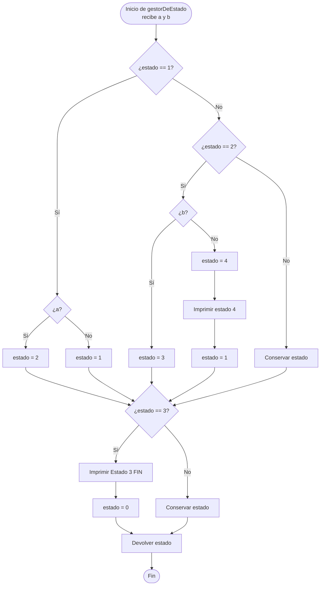

# Gestor de estado

Diagrama de flujo de `gestorDeEstado(a, b)`. La variable `estado` es global y conserva su valor entre llamadas.

```mermaid
flowchart TD
    A([Inicio de gestorDeEstado<br/>recibe a y b]) --> B{¿estado == 1?}

    B -- Sí --> C{¿a?}
    C -- Sí --> D[estado = 2]
    C -- No --> E[estado = 1]

    B -- No --> F{¿estado == 2?}
    F -- Sí --> G{¿b?}
    G -- Sí --> H[estado = 3]
    G -- No --> I[estado = 4]
    I --> J[Imprimir estado 4]
    J --> K[estado = 1]

    F -- No --> L[Conservar estado]

    D --> M{¿estado == 3?}
    E --> M
    H --> M
    K --> M
    L --> M

    M -- Sí --> N[Imprimir Estado 3 FIN]
    N --> O[estado = 0]
    M -- No --> P[Conservar estado]

    O --> Q[Devolver estado]
    P --> Q
    Q --> R([Fin])
```
# Base-de-datos-AD
